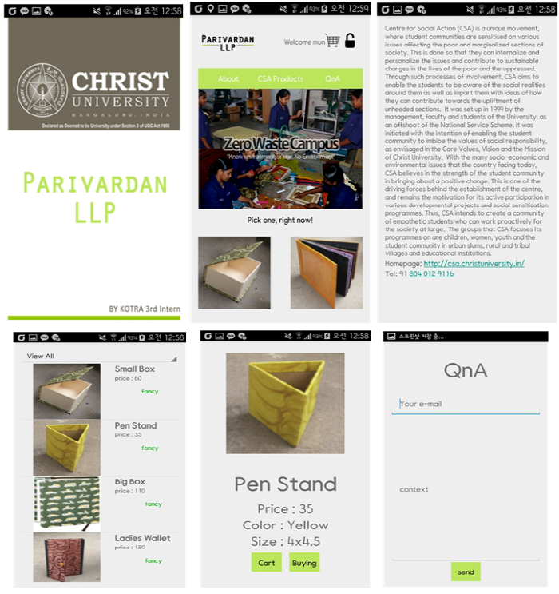

# CSAShop

This app is the test app. So we did NOT upload in the android app store.

## 1. Why did we kick-off this project?
Centre for Social Action (CSA) in Christ University is a unique movement, where student communities are sensitised on various issues affecting the poor and marginalized sections of society.

The purpose of this project is to strengthen the awareness and participation of people those who are interested in CSA movement. Furthermore, through spread of this application we can expect others to join this green movement.

## 2. Feature
This application provides two main services. 
+ Login
+ Register items through Web

## 3. Enviroment
+ Language: JAVA, JSP
+ DB: SQLite, MySQL
+ ETC: JSON

## 4. Screenshot

## 5. Copyright
(C) 2015. Kotra-Iolite India intern 3 batch & Christ University all rights reserved.
